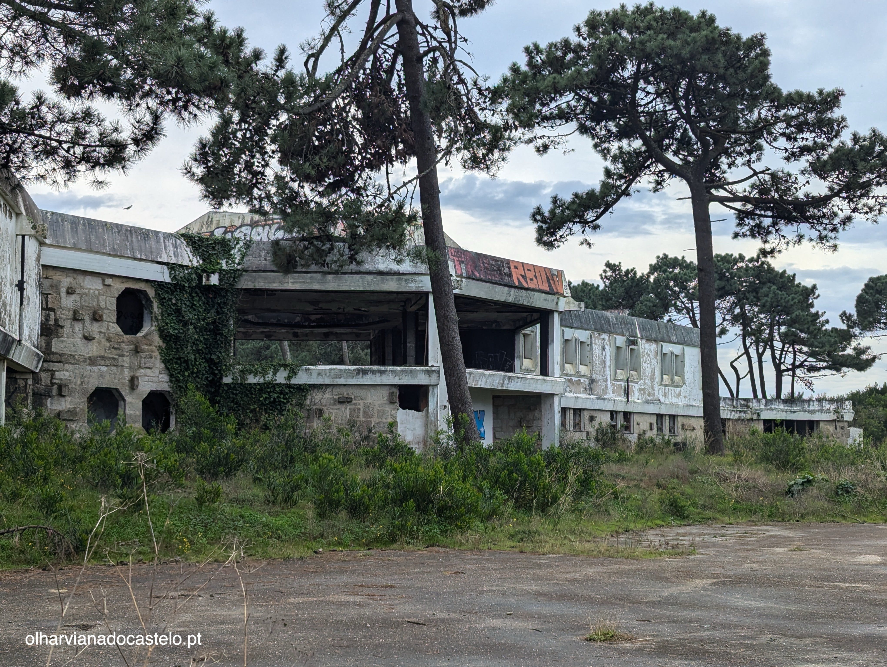
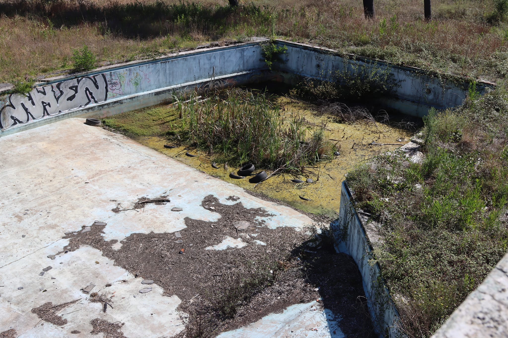
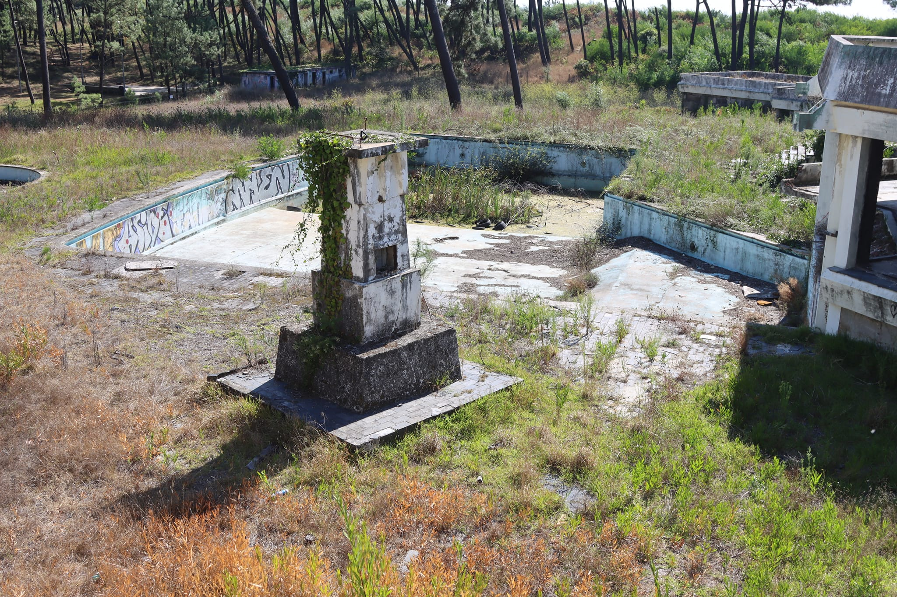
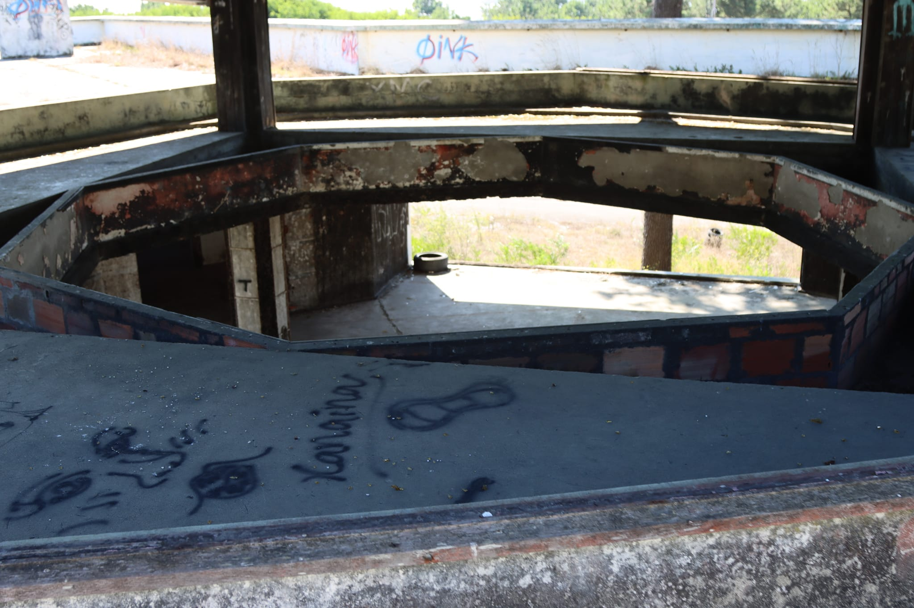

# Garden by the Sea

> *"Portugal is a garden by the sea."* — Fernando Pessoa

Turning the abandoned Luziamar complex next to Praia do Cabedelo in Viana do Castelo into the most magical cultural nexus point on the planet.

## Vibe Anchor

*The frequency of the dream: Hotel Adriano from Porco Rosso. A garden by the sea where life is celebrated — families during the day, magic at night, always open, always welcoming.*

---

## The Location

**Praia do Cabedelo, Viana do Castelo, Portugal**

- One of the best kitesurfing beaches in Europe
- First line of the beach, near the mouth of the Lima River
- 45 minutes from Porto Airport
- Blue Flag beach with golden sand, dunes, and coastal pine forest

### The Property

- **Size**: ~20,000 m² of beachfront land
- **Status**: Abandoned since ~1995, [actively listed for sale](https://www.construcoesrites.com/en-gb/property/hotel-for-sale-in-luziamar-cabedelo-beach-in-viana-do-castelo-on-the-1st-line-of-the-beach-and-near-/17185928)
- **Current Owner**: [Construções Rites, Lda](https://www.racius.com/construcoes-rites-lda/) (Agostinho Rites, majority shareholder)
- **Permits**: Approved building permit for ~80 tourist apartments + facilities
- **Contact**: +351 258 828 798 | Praça da República, nº30, Viana do Castelo

### Building Architecture

The original 1969 design created a distinctive structure:
- **Three interconnected volumes**: Two parallelepipeds and a central octagon
- **Two main floors** plus a third-floor solarium on the eastern volume
- **360° panoramic views** from the main entertainment spaces

---

## The History: Luziamar (1974-1995)

### A Cultural Phenomenon

[Luziamar opened in 1974](https://noticiasdeviana.pt/de-meca-da-musica-a-lugar-abandonado-o-luziamar-faria-50-anos), just 12 days before Portugal's Carnation Revolution. For over two decades, it became legendary:

- **"The mecca of music"** — considered the best discotheque in Portugal and the Iberian Peninsula
- **Complete resort complex**: Discotheque, restaurant, bar, swimming pool, tennis courts, mini-golf
- **Revolutionary for its time**: 360° panoramic views, special effects (confetti, soap bubbles, slides)
- **Cultural icon**: Ranked alongside Romaria festival and Santa Luzia basilica as symbols of Viana do Castelo
- **Social hub**: "Where people found spouses, boyfriends, girlfriends" — a place that created lifelong connections

### The Closure Mystery

Around 1995, Luziamar closed. The reasons remain unclear — it wasn't lack of customers; the place was thriving. Since then:

- **2005**: [Fire consumed part of the complex](https://www.publico.pt/2005/10/14/local/noticia/viana-do-castelo-incendio-consome-parte-do-complexo-turistico-do-luziamar-1235657)
- **2005**: Owners announced €10 million restoration plan — never executed
- **2018-2020**: Academic thesis projects and design competitions — owners still seeking solutions
- **2025**: Building stands in ruins, but the memory lives on

**The building has been waiting for the right partners.**

### Today: The Ruins

The pool area tells the story of three decades of abandonment:

Inside, the famous 360° view octagon still stands:

### The Memory Lives On

People still throw **["Remember Luziamar"](https://noticiasdeviana.pt/de-meca-da-musica-a-lugar-abandonado-o-luziamar-faria-50-anos/)** parties in Viana do Castelo, celebrating the spirit of a place that closed three decades ago. There's even a traditional dish named after it: "Bacalhau à Luziamar."

This isn't just a building — it's a living memory in the collective consciousness of the region.